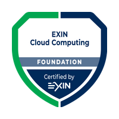
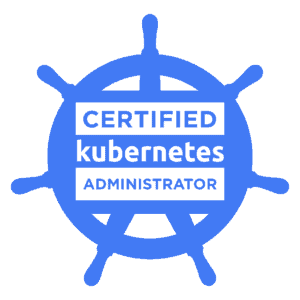

## Olá 

- 🔭 I’m currently working as Cloud Computing Solution Architect 
- 🌱 I currently study topics related to software engineering and solution delivery

<a href="https://github.com/jeliasmoreira">

      
         
    
          

 ## 

  
  
  
    

 ## 

 
