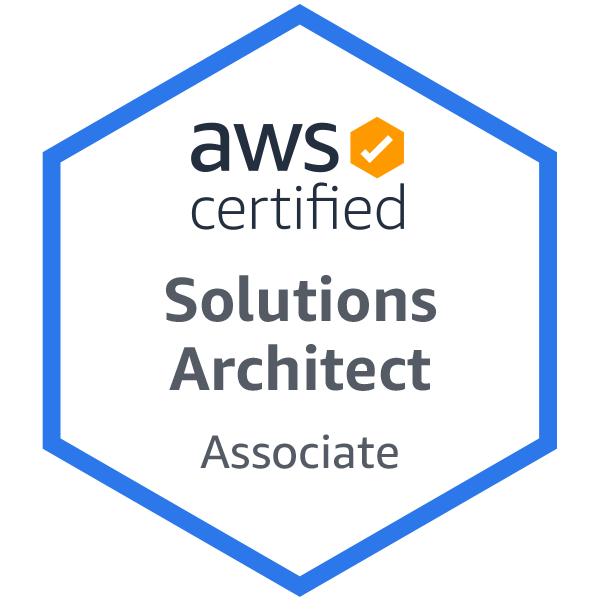

## Olá 

- 🔭 I’m currently working as Cloud Computing Solution Architect 
- 🌱 I currently study topics related to software engineering and solution delivery

  <a href="https://github.com/jeliasmoreira">
  
  

 

## Certificações tecnicas alcançadas até o momento 

 

## Tecnologis mais utilizadas em projetos que participo
    
    

 
  
      
         
    
    
        

 
  
 
  
